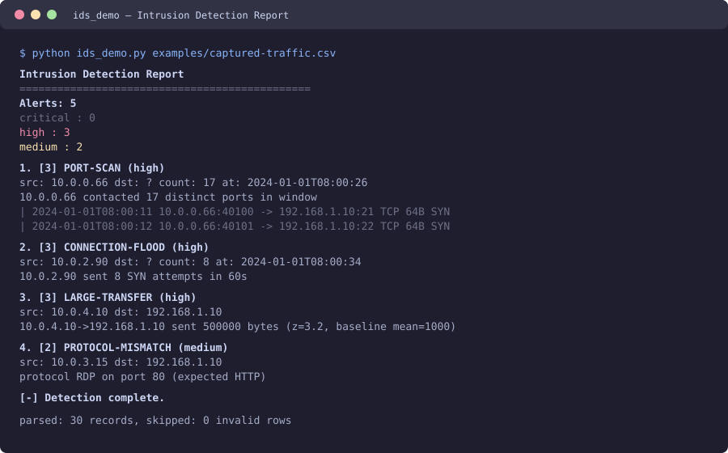
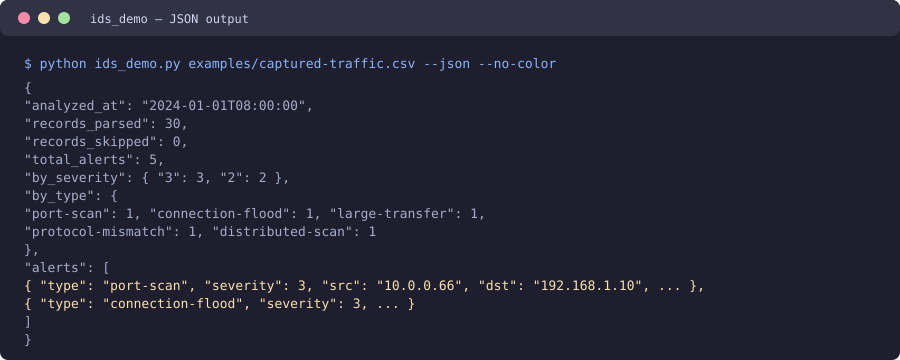

# Intrusion Detection Demo — Detector Básico de Anomalias de Tráfego / Basic Traffic Anomaly Detector

> 🌐 **Idiomas / Languages:** [Português (Brasil)](#português-brasil) · [English](#english)

---

# Português (Brasil)

Uma CLI **sem dependências** em Python que ingere um feed de tráfego de rede e sinaliza **padrões incomuns** com uma classificação de gravidade. É um olhar educacional e defensivo de como um IDS simples raciocina sobre tráfego — varredura de portas, inundações de conexão, beacons, transferências grandes, incompatibilidade de protocolo e varreduras distribuídas.

> ⚠️ **Apenas educacional.** Esta é uma ferramenta de aprendizado, não um sistema de detecção de intrusão de produção. Ela usa heurísticas simples sobre dados sintéticos ou capturados para demonstrar os fundamentos de detecção de anomalias. Não a use para monitorar tráfego real sem entender suas limitações e as leis/autorizações aplicáveis.

 -brightgreen) 

---

## Funcionalidades

- **Múltiplos formatos de entrada** — CSV (padrão), JSON e texto estilo netflow.
- **Seis regras de detecção** — cada uma ativável/desativável, cada uma com nível de gravidade.
- **Janela deslizante + análise estatística** — detecção baseada em taxa (varredura de portas, inundação, varredura distribuída) e baseada em z-score (grandes transferências, regularidade de beacon).
- **Pontuação de gravidade** — `baixo(1) / médio(2) / alto(3) / crítico(5)`.
- **Saída humana e para máquina** — relatório de console colorido ou `--json`.
- **Ajuste de regras** — `--enable` / `--disable`, limites por regra, gravidade mínima.
- **Zero dependências** — roda em Python 3.10+ stdlib apenas.

## Regras de detecção

Cada regra é uma *heurística educacional* que sinaliza um padrão reconhecível:

| Regra | O que procura | Gravidade |
| --- | --- | --- |
| `port_scan` | Uma origem contata muitos destinos distintos em uma janela. | alto |
| `flood` | Alta taxa de tentativas de conexão (SYN) a partir de uma origem. | alto |
| `distributed` | Muitas origens distintas atingem um único destino. | alto |
| `large_transfer` | Uma transferência com Z-score bem acima do baseline daquela origem. | alto |
| `beacon` | Uma origem fala com um destino em intervalos quase regulares. | médio |
| `protocol_mismatch` | Tráfego cujo protocolo não corresponde ao serviço conhecido da porta de destino. | médio |

## Arquitetura

```
ids_demo.py            # Ponto de entrada da CLI: argparse, leitura de feed, códigos de saída
└── ids/
    ├── models.py      # TrafficRecord, Alert, constantes de gravidade
    ├── io.py          # Leitores de feed CSV / JSON / netflow
    ├── detector.py    # Detector + DetectorConfig; todas as 6 regras de detecção
    └── reporter.py    # Relatório de console colorido + JSON
```

O fluxo: `ids_demo.py` lê o feed via `ids.io` → cada `TrafficRecord` é alimentado a `Detector.add()` → regras de janela rodam por registro, regras estatísticas rodam em `Detector.finalize()` → `reporter.py` renderiza um relatório de console ou JSON.

## Instalação

```bash
git clone https://github.com/Gmotas/intrusion-detection-demo.git
cd intrusion-detection
# Não precisa instalar nada — o núcleo roda em Python 3.10+ stdlib.
python ids_demo.py -h
```

Ou instale como um pacote (opcional), que cria o comando `ids-demo`:

```bash
pip install .
ids-demo -h
```

Dependências de desenvolvimento (opcionais, para testes):

```bash
pip install -r requirements.txt   # apenas pytest
```

## Início rápido

```bash
# Detecte tráfego incomum no feed de exemplo incluído.
python ids_demo.py examples/captured-traffic.csv

# Saída para máquina.
python ids_demo.py examples/captured-traffic.csv --json --no-color

# Apenas alertas de alta gravidade.
python ids_demo.py examples/captured-traffic.csv --min-severity 3

# Um feed de texto estilo netflow.
python ids_demo.py feed.txt --input-format netflow
```

### Exemplo de saída

```
Intrusion Detection Report
==============================================
Alerts: 5
  critical : 0
  high     : 3
  medium   : 2

 1. [3] PORT-SCAN (high)
  src: 10.0.0.66  dst: ?  count: 17  at: 2024-01-01T08:00:26
  10.0.0.66 contacted 17 distinct ports in window
    | 2024-01-01T08:00:11 10.0.0.66:40100 -> 192.168.1.10:21 TCP 64B SYN
    | 2024-01-01T08:00:12 10.0.0.66:40101 -> 192.168.1.10:22 TCP 64B SYN
    | 2024-01-01T08:00:13 10.0.0.66:40102 -> 192.168.1.10:23 TCP 64B SYN

 2. [3] CONNECTION-FLOOD (high)
  src: 10.0.2.90  dst: ?  count: 8  at: 2024-01-01T08:00:34
  10.0.2.90 sent 8 SYN attempts in 60s

 3. [3] LARGE-TRANSFER (high)
  src: 10.0.4.10  dst: 192.168.1.10
  10.0.4.10->192.168.1.10 sent 500000 bytes (z=3.2, baseline mean=1000)

[-] Detection complete.
```

### Saída JSON

```bash
python ids_demo.py examples/captured-traffic.csv --json
```

```json
{
  "analyzed_at": "2024-01-01T08:00:00",
  "records_parsed": 30,
  "records_skipped": 0,
  "total_alerts": 5,
  "by_severity": { "3": 3, "2": 2 },
  "by_type": { "port-scan": 1, "connection-flood": 1, "large-transfer": 1, "protocol-mismatch": 1, "distributed-scan": 1 },
  "alerts": [ { "type": "port-scan", "severity": 3, ... } ]
}
```

## Notas de uso

- `--min-severity` (`1/2/3/5`) filtra ruído de prioridade baixa.
- `--enable` / `--disable` ativam/desativam regras individuais (repetíveis).
- `--top N` mostra apenas os N alertas mais graves.
- `--quiet` imprime apenas `SUSPICIOUS` ou `CLEAN` (útil em scripts).
- Códigos de saída: `0` normal, `1` alertas detectados, `2` erro de uso/análise.

## Formato do feed

Cabeçalho CSV:

```
timestamp,src_ip,src_port,dst_ip,dst_port,protocol,bytes[,flags]
```

`flags` é opcional; `SYN` é tratado como tentativa de conexão. Veja `examples/captured-traffic.csv` para um exemplo rotulado.

## Testes

```bash
pip install pytest
pytest -q
```

A suíte cobre os leitores de feed e cada regra de detecção com dados sintéticos — sem necessidade de acesso à rede.

## Capturas de tela

Os mockups de terminal abaixo mostram o **Intrusion Detection Demo em ação** — detecção de padrões incomuns de tráfego com classificação de gravidade. (Arquivos em `screenshots/`.)

| **Relatório de console** | **Saída JSON** |
| --- | --- |
|  |  |
| *Detecção de anomalias de tráfego (varredura de portas, inundação, grande transferência).* | *Saída legível por máquina para integrar com outras ferramentas.* |

## Aviso / Uso ético

Esta ferramenta é uma **demonstração educacional** de heurísticas básicas; ela **não** é um IDS de produção e produzirá tanto falsos positivos quanto falsos negativos. Use-a em dados que você possui ou tem permissão de analisar. Respeite as leis e autorizações aplicáveis. A lógica de detecção é intencionalmente simples e legível para que você aprenda como a detecção de anomalias funciona.

## Licença

MIT. Veja o `LICENSE` (ou a raiz do repositório) para detalhes.

---

# English

A **dependency-free** Python CLI that ingests a network-traffic feed and flags **unusual patterns** with a severity rating. It's an educational, defensive look at how a simple IDS reasons about traffic — port scans, connection floods, beacons, large transfers, protocol mismatches and distributed scans.

> ⚠️ **Educational only.** This is a learning tool, not a production intrusion-detection system. It uses simple heuristics on synthetic or captured data to demonstrate anomaly-detection fundamentals. Do not use it to monitor real traffic without understanding its limitations and applicable laws/authorization.

 -brightgreen) 

---

## Features

- **Multiple input formats** — CSV (default), JSON, and netflow-style text.
- **Six detection rules** — each toggleable, each with a severity level.
- **Sliding-window + statistical analysis** — rate-based (port scan, flood, distributed scan) and z-score-based (large transfer, beacon regularity) detection.
- **Severity scoring** — `low(1) / medium(2) / high(3) / critical(5)`.
- **Human & machine output** — colorized console report or `--json`.
- **Rule tuning** — `--enable` / `--disable`, per-rule thresholds, minimum severity.
- **Zero dependencies** — runs on Python 3.10+ stdlib only.

## Detection rules

Each rule is an *educational heuristic* that flags a recognizable pattern:

| Rule | What it looks for | Severity |
| --- | --- | --- |
| `port_scan` | One source contacts many distinct destinations in a window. | high |
| `flood` | High rate of connection attempts (SYN) from one source. | high |
| `distributed` | Many distinct sources hit a single destination. | high |
| `large_transfer` | A transfer Z-scores far above that source's baseline. | high |
| `beacon` | A source talks to one destination at near-regular intervals. | medium |
| `protocol_mismatch` | Traffic whose protocol doesn't match the dest port's well-known service. | medium |

## Architecture

```
ids_demo.py            # CLI entry point: arg parsing, feed reading, exit codes
└── ids/
    ├── models.py      # TrafficRecord, Alert, severity constants
    ├── io.py          # CSV / JSON / netflow feed readers
    ├── detector.py    # Detector + DetectorConfig; all 6 detection rules
    └── reporter.py    # Colorized console + JSON report builders
```

The flow: `ids_demo.py` reads the feed via `ids.io` → each `TrafficRecord` is fed to `Detector.add()` → windowed rules run per-record, statistical rules run in `Detector.finalize()` → `reporter.py` renders a console report or JSON.

## Installation

```bash
git clone https://github.com/Gmotas/intrusion-detection-demo.git
cd intrusion-detection
# No install required — the core runs on Python 3.10+ stdlib.
python ids_demo.py -h
```

Or install it as a package (optional), which creates the `ids-demo` command:

```bash
pip install .
ids-demo -h
```

Dev deps (optional, for tests):

```bash
pip install -r requirements.txt   # pytest only
```

## Quickstart

```bash
# Detect unusual traffic in the included sample feed.
python ids_demo.py examples/captured-traffic.csv

# Machine-readable output.
python ids_demo.py examples/captured-traffic.csv --json --no-color

# Only high-severity alerts.
python ids_demo.py examples/captured-traffic.csv --min-severity 3

# A netflow-style text feed.
python ids_demo.py feed.txt --input-format netflow
```

### Sample output

```
Intrusion Detection Report
==============================================
Alerts: 5
  critical : 0
  high     : 3
  medium   : 2

 1. [3] PORT-SCAN (high)
  src: 10.0.0.66  dst: ?  count: 17  at: 2024-01-01T08:00:26
  10.0.0.66 contacted 17 distinct ports in window
    | 2024-01-01T08:00:11 10.0.0.66:40100 -> 192.168.1.10:21 TCP 64B SYN
    | 2024-01-01T08:00:12 10.0.0.66:40101 -> 192.168.1.10:22 TCP 64B SYN
    | 2024-01-01T08:00:13 10.0.0.66:40102 -> 192.168.1.10:23 TCP 64B SYN

 2. [3] CONNECTION-FLOOD (high)
  src: 10.0.2.90  dst: ?  count: 8  at: 2024-01-01T08:00:34
  10.0.2.90 sent 8 SYN attempts in 60s

 3. [3] LARGE-TRANSFER (high)
  src: 10.0.4.10  dst: 192.168.1.10
  10.0.4.10->192.168.1.10 sent 500000 bytes (z=3.2, baseline mean=1000)

[-] Detection complete.
```

### JSON output

```bash
python ids_demo.py examples/captured-traffic.csv --json
```

```json
{
  "analyzed_at": "2024-01-01T08:00:00",
  "records_parsed": 30,
  "records_skipped": 0,
  "total_alerts": 5,
  "by_severity": { "3": 3, "2": 2 },
  "by_type": { "port-scan": 1, "connection-flood": 1, "large-transfer": 1, "protocol-mismatch": 1, "distributed-scan": 1 },
  "alerts": [ { "type": "port-scan", "severity": 3, ... } ]
}
```

## Usage notes

- `--min-severity` (`1/2/3/5`) filters low-priority noise.
- `--enable` / `--disable` toggle individual rules (repeatable).
- `--top N` shows only the N most severe alerts.
- `--quiet` prints just `SUSPICIOUS` or `CLEAN` (handy in scripts).
- Exit codes: `0` normal, `1` alerts detected, `2` usage/parse error.

## Feed format

CSV header:

```
timestamp,src_ip,src_port,dst_ip,dst_port,protocol,bytes[,flags]
```

`flags` is optional; `SYN` is treated as a connection attempt. See `examples/captured-traffic.csv` for a labelled example.

## Testing

```bash
pip install pytest
pytest -q
```

The suite covers the feed readers and each detection rule with synthetic data — no network access needed.

## Screenshots

The terminal mockups below show the **Intrusion Detection Demo in action** — detection of unusual traffic patterns with severity classification. (Files in `screenshots/`.)

| **Console report** | **JSON output** |
| --- | --- |
|  |  |
| *Traffic-anomaly detection (port scan, connection flood, large transfer).* | *Machine-readable output for integration with other tooling.* |

## Disclaimer / Ethical Use

This tool is an **educational demonstration** of basic heuristics; it is **not** a production IDS and will produce both false positives and false negatives. Use it on data you own or have permission to analyze. Respect applicable laws and authorization. The detection logic is intentionally simple and readable so you can learn how anomaly detection works.

## License

MIT. See `LICENSE` (or the repo root) for details.
